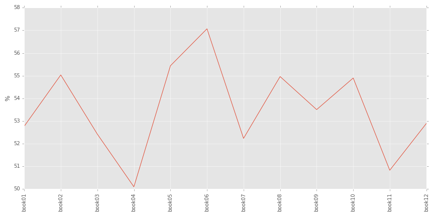
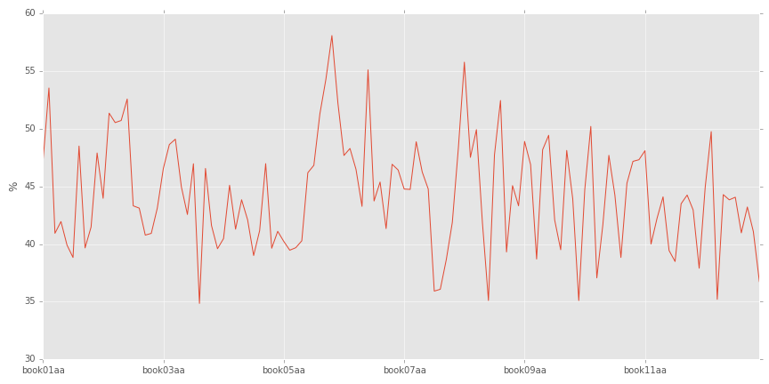
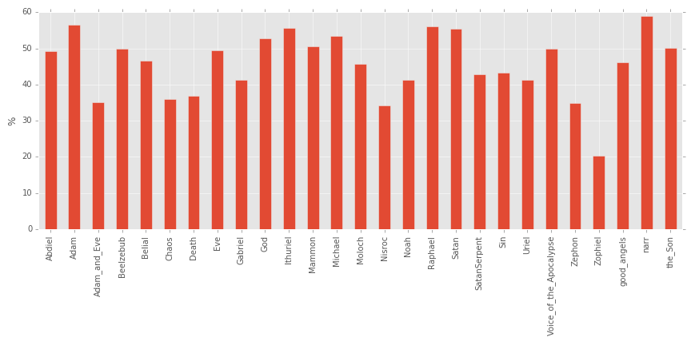
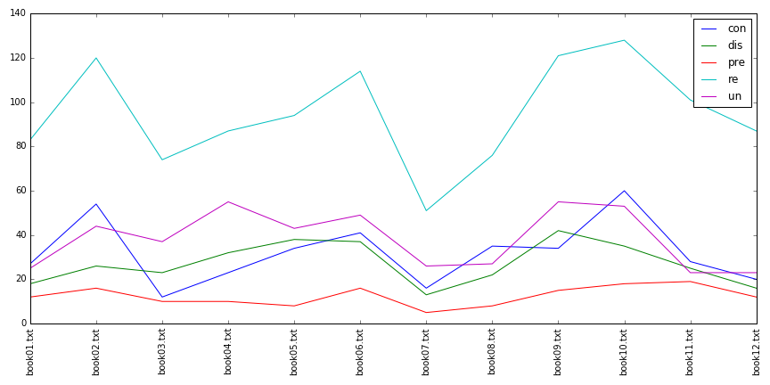

One of Milton’s terms for the expansive, empty gulf separating the Earth from Hell is the “abyss.” The word appears eighteen times in _Paradise Lost_, and in seven out of twelve of the poem’s books. It is variously described as “vast,” “dark,” “infinite,” “hollow,” “wild,” “wide,” “desolate,” and “vexed,” (1.21, 2.405, 2.518, 2.910, 3.84, 4.936, 10.314) but also more epistemologically as “immeasurable,” “untractable,” and “unbottomed” (7.211, 10.476, 2.405). Besides emphasizing the distance of Satan’s followers’ fall, these last three Chaotic epithets highlight the etymology of “abyss,” as derived from the ancient Greek _ἄβυσσος_ meaning, according to the _OED_, “bottomless, unfathomed, unfathomable, boundless” [@_abyss_2011]. This is but one example of the way Milton acknowledges the origins of words, and how the logic of his poem depends heavily on etymology. Much has been made of this. On this basis, critics such as Samuel Johnson, F.R. Leavis, and T.S. Eliot dismiss Milton as un-English. More recently, Christopher Ricks, Hannah Crawforth, and John Hale celebrate him for his multilingual style. However, whether approving or disapproving of this method, no critic has yet attempted to quantitatively measure the etymologies of Milton’s words. The following describes an experiment in macro-etymological analysis of Milton’s _Paradise Lost_, whereby the origins of the epic’s words are quantified by book, section, and speaker. This experiment hopes to reveal trends in the voices and resonances of the poem’s etymological registers that invite the reader to imagine Biblical or classical parallels. 

Milton is perhaps the ideal subject for a macro-etymological analysis. By some accounts, he was familiar with around ten languages, and wrote fluently in at least four [@hale_miltons_1997 8]. Among these were French, Latin, and Ancient Greek: the major ancestral languages of English. Milton’s multilinguality is one factor that leads Roy Flannagan to dub him “the most etymological of poets,” explaining that “he may use a word in two English senses, several Latin senses, and a Greek sense, all at the same time,” citing in particular his use of “essence” and “effluence” [@milton_riverside_1998 316]. John Carey and Alistair Fowler observe that “Milton would of course know the etymology of many of the words in _Paradise Lost_,” and add that “the interplay between words of Romance and of Anglo-Saxon origin is an important feature of Milton’s style” [@milton_poems_1968 431]. It is exactly this interplay that the present experiment proposes to measure. 

In an obscure Latin work of Milton’s, _The Art of Logic_, he argues that etymological work can help to discover the truer (more divine) sense of a concept. He does so using a lapsarian metaphor quite familiar to readers of _Paradise Lost_ and a more specifically linguistic metaphor: that of the tower of Babel.

>Languages, both that first one which Adam spoke in Eden, and those varied ones also possibly derived from the first, which the builders of the tower of Babel suddenly received, are without doubt divinely given; hence it is not strange if the reason of primitive words is unknown. But as to those words that are derived or composite, either their origins are to be sought in other languages ancient and now obsolete, or by their own antiquity and the usually corrupt pronunciation of the lower classes are so changed, and by the habit of writing them falsely are so obliterated as it were that a true notation of words very seldom may be had. [@milton_fuller_1935 219-21]

The “sudden receiving” of language at the tower of Babel also takes place in the concluding book of _Paradise Lost_: 

>Quite out their native language, and instead  
To sow a jangling noise of words unknown:  
Forthwith a hideous gabble rises loud  
Among the builders; each to other calls  
Not understood, till hoarse, and all in rage,  
As mocked they storm; great laughter was in heaven  
And looking down, to see the hubbub strange  
And hear the din; thus was the building left  
Ridiculous, and the work Confusion named.  

This passage features a smattering of onomatopoeia—“jangling,” “gabble,” and “hubbub”—words with non-classical etymologies, that is, “primitive words” whose “reason” is “unknown.” The _OED_ notes that although “Babel” and the onomatopoetic “babble” are etymologically unrelated, it is related to French “_babel_,” “confusion of opinions,” and in Genesis 11 it is “folk-etymologically associated with Hebrew bālal ‘to confuse, confound.’” [@_babel_2011]. The linguistic fall from grace that Milton recreates in this Babel scene, therefore, can be viewed as etymological. 

Later in _The Art of Logic_, Milton illustrates his logical system by arguing on Latin etymological grounds that the statement “he is a man, therefore he is from the earth,” _homo ab humo_, is preferable to its opposite, “he is from the earth, therefore he is a man,” _humo ab homo_ [@milton_fuller_1935 219]. This rhyming etymological connection is one which fuels God’s pun in _Paradise Lost_: “because in thee / Love hath abounded more then Glory abounds / Therefore thy Humiliation shall exalt / With thee thy Manhood also to this Throne” (3.311-14). This sense of “humiliation” is not the _OED_ sense 2 of “humiliate,” in which it is most commonly used today, “to lower or depress the dignity or self-respect of,” although it retains these undertones [@_humiliate_1899]. It is closer to the first sense, now obscure, “to make low or humble in position,” but closer still to the etymological sense of the word, ultimately descended from _humus_, “ground, earth” [@_humble_1899]. Thus, the Son “humiliates” himself by going down to Earth. Furthermore, by incarnating himself, he is enacting the same kind of transmogrification of Genesis 2.7, where Adam is formed from earth, a literalization of _humo ab homo_. 
 
Milton’s etymological sense, that which refigures “humiliation” into “Earth-going,” is exactly that to which some critics have objected. Some have called this Milton’s “Latinity,” and argue that it detracts from his poetic power in English. Samuel Johnson ridicules Milton’s “play on words, in which he delights too often,” and counts among his faults his propensity “to use English words with a foreign idiom” [@thorpe_milton_1966 84, 86]. Johnson concludes that “of him, at last, may be said what Jonson says of Spenser, that _he wrote no language_, but has formed what Butler calls a _Babylonish Dialect_, in itself harsh and barbarous, but made by exalted genius and extensive learning”  [-@thorpe_milton_1966 86]. 

T.S. Eliot happily quotes this passage from Johnson in his critique of Milton, adding that Milton has been a “bad influence” over centuries of poets, in part due to “the peculiar kind of deterioration ... to which he subjected language” [-@eliot_note_1936 32]. This deterioration he attributes to Milton’s affinity for Latin and Greek: “Milton writes English like a dead language. The criticism has been made with regard to his involved syntax” [-@eliot_note_1936 35].

Similarly, Joseph Addison, writing in _The Spectator_ in the eighteenth century, derides Milton for his poor punning. He quotes from a passage in Book 6 where Belial answers Satan, calling it “nothing else but a string of puns, and those too very indifferent” [-@thorpe_spectator_1966 37]: 

>stumbl’d many, who receives them right,    
Had need from head to foot well understand;     
Not understood, this gift they have besides,     
They show us when our foes walk not upright. (6.609-29)      

The pun that Addison notices is a kind of literalizing folk etymology of “understand,” refiguring comprehension as a kind of posture, an “upright” “standing” “from head to foot.” These kinds of puns happen throughout _Paradise Lost_, and they are often etymological in nature. It is this kind of linguistic wordplay that invites an analysis of the poem attentive to its etymological registers. 

#Experimental Design

The following macro-etymological analysis was conducted with a tool I developed for this purpose called the Macro-Etymological Analyzer. The tool divides a given text into its constituent words, lemmatizes the words (transforms them into their dictionary forms), removes commonly-used words such as “a” and “the” (“stopwords,”) and looks up each remaining word in the [Etymological Wordnet](http://www1.icsi.berkeley.edu/~demelo/etymwn/), a multilingual etymological database created by computer scientist Gerard de Melo. If the program finds that a word’s ancestor is Middle English, its default behavior is to go one generation deeper, since a large proportion of English words have Middle English ancestors. The program then tallies the words of the text according to their origin languages and origin language families. This groups together words descended from Old English, Old Norse, and other Germanic languages under the language family “Germanic,” and groups together words descended from Latin, French, Anglo-Norman, and other Romance languages under “Latinate.” Words descended from Ancient Greek are categorized as Hellenic, and so on. 

Although the Macro-Etymological Analyzer was originally written as [a web app](http://jonreeve.com/etym) designed to analyze single files, I rewrote the program in Python with a command-line interface (CLI), in order to allow it to be scriptable, and allow for easy analysis of multiple files. Thus, instead of uploading individual files to a server and analyzing them one-by-one, users may execute the CLI interface, leveraging shell expansion: `python macro_etym.py paradise-lost-books/*.txt`, where `*.txt` will be expanded to match all the text files in the directory. Furthermore, the tool was modified so that it can easily output a file formatted with comma separated values (CSV), an easily machine-readable format. This allows for simple post-analysis of the data generated by the initial macro-etymological analysis.

Apart from the tool creation, preparation of the _Paradise Lost_ text was one of the most labor-intensive processes in this analysis. To begin, [an edition of _Paradise Lost_ richly marked-up in Text Encoding Initiative Extensible Markup Language](http://ota.ox.ac.uk/desc/3022) (TEI XML) was retrieved from the [Oxford Text Archive](http://ota.ox.ac.uk/). The greatest difficulty of dealing with this text was that the orthography was retained in its original, a feature incompatible with the modern spellings used in the Etymological Wordnet. To correct this problem, I used the [VARD 2](http://ucrel.lancs.ac.uk/vard/about/) tool to normalize the spelling in a quasi-supervised way. First, the text was automatically corrected using VARD’s native dictionary, given a threshold of 40% certainty. From there, the text was corrected by hand, manually replacing thousands of words with their modern equivalents. This resulted in [a new, semi-automatically generated edition](https://github.com/JonathanReeve/milton-analysis/blob/master/pl-normalized.xml) of the text, where normalized variants are marked up as, for instance, `<normalised orig="exprest" auto="true">expressed</normalised>`.

One of the most useful features of this TEI XML edition is that speech attribution is semantically marked up with milestones, as in `<milestone n="narr" unit="sp"/>`, where `narr` is the narrator of the poem. In this case, the narrator’s speech follows this tag. This allows for the extraction of speech elements, although not in the usual way, using an XML parsing library. Instead, I wrote [a script](https://github.com/JonathanReeve/milton-analysis/extract/pl-dialog-extractor.ipynb) to retrieve the all the speech between these tags using regular expressions. The script categorizes each text chunk by speaker, and writes the aggregated text to individual text files, using the character’s name as the filename. This allows for a simple macro-etymological analysis using the shell expansion command outlined above. 

In order to analyze the individual books of the poem, I wrote [a similar script](https://github.com/JonathanReeve/milton-analysis/extract/pl-books-extractor.ipynb) that parses the XML and extracts the text contained within `
` tags. To divide these into subsections for more fine-grained analysis, I constructed a simple BASH command that uses the GNU command `split` to divide each book into equal-sized chunks: `for file in *; do split -n 10 $file ${file:r}; done`.

#Results

Overall, once stopwords are removed, roughly 60% of the words of _Paradise Lost_ are Latinate, from Anglo-Norman, French, Middle French, Old French, and Latin, mostly. Another 35% are Germanic, from Old English, Old Norse, or German. The remaining few percentage points are divided between Hellenic (Ancient Greek, at around 1%), Semitic (Hebrew, 0.25%), and other language families. Since Latinate and Germanic proportions account for the majority of the total words of the poem, they correlate negatively with one another. A high proportion of Latinate words in a section almost always means a low proportion of Germanic words. For this reason, this study will mostly examine the proportions of Latinate words in _Paradise Lost_.

{#fig:books-latinate} 

[@fig:books-latinate] shows the overall proportions of Latinate words in the books of _Paradise Lost_. The Latinity of the epic starts, one might say, _in medias res_, grows as the rhetoric of Hell reaches a climax in Book 2, but dips back down by Book 3 with the less Latinate dialogue between God and the Son. Book 4 is the absolute nadir, representing the lowest proportion of Latinate words: this corresponds with Satan’s (and our) first glimpse of Adam and Eve, and the natural world of Eden which Milton represents using words of Germanic origin. After Book 4, the Latinity of the poem increases until it reaches an absolute climax in Book 6. Since Raphael relates the heavenly war in Book 6 using the armaments and materials of classical epics, this high proportion suggests a correlation with a classicist mode. After Book 6, the books alternate in Latinity, although decreasing steadily until the poem ends. 

When this analysis is conducted on a finer scale, that is, when each book is broken into ten sections, a different picture emerges. [@fig:subsections-latinate] shows proportions of Latinate words per subsection.
Sharp alternations between high and low Latinate proportions characterize most of this poem---the sawtooth shape suggests that Milton is quickly switching rhetorical modes, and that this switching increases its pace as the poem progresses.  

In this finer analysis, the most Latinate passage is not in Book 6, in fact, but directly before it, in the penultimate section of Book 5, `ai` (sections are ordered `aa-aj`). This section starts at line 716 and continues through 815. It contains Satan’s speech to his followers, where he attempts to convince them with “calumnious Art of counterfeited truth” (770-1), and to tempt them with “Thrones, Dominations, Princedoms, Virtues, Powers” (772), so long as “these magnific titles yet remain not merely titular” (773-4). With the exception of the Anglo-Saxon-derived “Princedoms,” all of the words in this series are descended from Latin, and arrive either through French or through Anglo-Norman. 

{#fig:subsections-latinate}

This section has Satan assume an air of high rhetoric, where he will ask, “Who can in reason then or right assume / Monarchy over such as live by right [God’s] equals, if in power and splendor less, / In freedom equal?” (795-8). This is a similar stance toward monarchy as presented in Milton’s tract, “The Ready and Easy Way to Establish a Free Commonwealth,” also a heavily Latinate text. Roy Flannagan explains that this speech of Satan’s is “characterized by orotundity and repetition,” and that his choice of the Latinate “magnific” at 773, instead of an Anglo-Saxon “great” or “great-making,” “shows how Satan is flattering his audience” [@milton_riverside_1998 500]. 

In contrast, Abdiel’s response to Satan is much less Latinate and thus much more Germanic. He argues that “to [God’s] only Son by right endued / With regal scepter, every soul in heaven / Shall bend the knee, and in that honor due / Confess him rightful king” (815-18). Abdiel’s rhetorical authority comes not from high Latinate eloquence, but from a primal Germanic power: apart from the Latinate “endued,” “regal,” “scepter,” this retort is peppered with the Old English-derived words “son,” “soul,” “heaven,” “bend,” “knee,” “rightful,” and “king.”

The passage with the lowest proportions of Latinate words is Book 3, section `ag`, which starts at line 429, and continues until 507. The passage that directly precedes this section begins by marking the stark contrast between the scene of heavenly rejoicing for the Son and Satan’s vulture-like circling of the Earth: 

>Thus they in heaven, above the starry sphere,    
Their happy hours in joy and hymning spent.     
Meanwhile upon the firm opacous globe    
Of this round world, whose first convex divides    
The luminous inferiour orbs, enclosed     
From Chaos and the inroad of darkness old,     
Satan alighted walks (416-22)     

The macro-etymological shift from Latinate to Germanic in this section enacts the heaven/Satan contrast along the fault-lines of language history. Directly after this passage, the narrator describes in heavily Germanic speech this liminal space between Chaos and the earth, as “dark, waste, and wild, under the frown of night / Starless” (425-6). Milton then compares Satan, in an epic simile, to “a vulture on Imaus bred, / Whose snowy ridge the roving Tartar bounds” (431-2). (Flannagan explains that “_Imaus_” etymologically conveys the idea of a snow-capped mountain [@milton_riverside_1998 428]). This vulture departs from “a Region scarce of prey” in order to 

>gorge the flesh of lambs or yeanling kids    
On hills were flocks are fed, flies toward the springs    
Of Ganges or Hydaspes, Indian streams;     
But in his way lights on the barren plains    
Of Sericana, where Chineses drive    
With sails and wind their cany wagons light:     
So on this windy sea of land, the fiend    
Walked up and down alone bent on his prey (434-441)    

This passage, while very geographical, is also primal, pastoral, and earthy: qualities all associated with the Germanic register. The pastoral image of “yeanling kids” is, of course, ultimately a dark one, where their flesh is feasted upon by this vulture. This makes the pastoral/prey contrast, as in the heaven/Chaos contrast above, all the more stark. Germanic words here, such as “hills,” “flocks,” “flies,” “springs,” “lights,” “plains,” “drive,” “sails,” “wind,” and “sea,” not only serve to contrast with the vulture and thus with Satan, but set the scene, even in this brief aside, for the introduction of the World in Book 4.

The etymological contrast between Satan and Abdiel noted above occurs between many other characters in _Paradise Lost_, as well. As each character has his or her own voice, motives, and rhetorical style, these features are often reflected in the etymologies of their words. [@fig:speakers-latinate] shows the Latinate proportions for each of the speakers in _Paradise Lost_. The speakers with the highest percentages of Latinate words are the narrator, Adam, and Raphael, while the speakers with the lowest are the minor characters Zophiel, Nisroc, and Zephon^[A complete list may be found in the [analyze-pl](https://github.com/JonathanReeve/milton-analysis/macro-etym/analyze-pl.ipynb) notebook.]. With only 84, 131, and 76 words each, however, these last three fallen angels likely do not show high proportions of Latinate words simply because they are not given the chance to---their speech samples are not large enough. Analyzing only the main characters---that is, characters who speak more than two thousand words^[These characters are the narrator, Adam, Eve, God, the Son, Satan, Michael, and Raphael.]---the characters with the lowest proportions of Latinate words are Eve, the Son, and the Father. This seems to suggest that the narrator, Adam, and Raphael all perform higher levels of discourse than God, the Son, and Eve.

To study the voices of the characters in greater detail, I wrote [a script to determine each character’s distinctive words](https://github.com/JonathanReeve/milton-analysis/tf-df/tfidf-custom.ipynb). This script works by counting each word a speaker uses, and divides that count by the number of times it is used by other speakers. To avoid difficulties arising from comparing characters with logarithmically different word counts, I again only compared the major characters. The most distinctive word of the narrator is “replied,” which he or she uses almost four times as often as any other character. There aren’t very many Latinate words in this list, although the narrator’s twelfth most distinctive word is “answered.” Since both of these words are functional for telling a story in the past tense, the narrative task might account for some of the narrator’s high proportions of Latinate words.

Before stopwords are removed, the resulting distinctive words are revealing about the characters’ voices. Of Satan’s, John Hale argues that “that voice is many things but always self-preoccupied” [-@hale_miltons_1997 136]. Yet a closer look at Satan’s distinctive words shows “you,” “your” and “ye” ranked in his top four, seemingly refuting Hale’s claim. Adam’s distinctive words, on the other hand, are much more self-preoccupied: “us,” “my,” and “we” suggest introversion. 

Adam’s most distinctive word, once stopwords were removed, however, is the word “sustain,” descended from Latin and arriving in English via Anglo-Norman. There are the Latinate words “approve,” “absence,” and “favor,” but also the distinctly Anglo-Saxon words “bone,” “dust,” “need,” and “feel.”. By contrast, Eve’s most distinctive words are the Latinate “forbids,” but also the Germanic “early,” “dreamed,” “glistering,” and “help.” The top distinctive words of God and the Son, at ranks #1 and #2, respectively, are the Latinate words “redeem” and “redeemed.” One might hypothesize that these would be words distinctive of fallen angels eager to reenter heaven, so it is surprising that they should correlate instead with the heavenly monarchy.

{#fig:speakers-latinate} 

One of the superficial features of Latinate words is that they are frequently composed of root words and affixes. The Latinate prefixes “con-,” “dis-,” “pre-,” “un-,” and “re-” are especially common in _Paradise Lost_. [@fig:prefixes-books-notnormalized] shows the distribution of these prefixes across the books of the poem. This distribution was generated using [a simple Conditional Frequency Distribution](../cfd-plots.ipynb) from the Python Natural Language Toolkit (NLTK) module, which tests whether a word starts with the prefix. To account for words like “rest,” which in fact begins with “re-” but is not etymologically composed of the “re-” prefix, I created a blacklist containing words like “regent,” “reason,” “prey,” “under,” and “union.” 

{#fig:prefixes-books-notnormalized}

“Re-” is by far the most common of these prefixes, accounting for the distinctive word of the narrator, “replied,” as well as God and the Son’s distinctive lemma, “redeem.” Book 10 shows the highest frequency of this prefix, as to be expected for a postlapsarian book of regret and inability to return. In fact, the word “return” occurs sixteen times in Book 10, as in Adam’s lament “dust I am, and shall to dust return” (770) and the Son’s sentence “in the sweat of thy face shalt thou eat bread, / Till thou return unto the ground” (205-6). Milton doubles “re-” words frequently in this book, as well, with “reflux on me redound” (739), “with stern regard he thus repelled,” (866), and “Eve, recovering heart, replied” (966). The book ends with Eve’s “remorse” (1098) and with the couple’s “reverent” (1100) posture of prayer before God. 

If “re-” is the prefix most characteristic of Book 10, then “dis-” is that of the preceding Book 9. Introducing the book, the narrator warns that he will speak no more of “rural repast,” (another “re-” word) (4), but must change the tone (and implictly the predominant prefix) of the poem: 

>\ \ \ \ \ \ \ \ \ \ \ \ \ \ \ \ \ \ \ \ \ \ \ \ \ \ \ \ \ \ \ \ \ \ \ \ \ \ \ I now must change    
those notes to tragic; foul distrust, and breach     
Disloyal on the part of man, revolt,     
And disobedience: on the part of heaven    
Now alienated, distance and distaste (5-9)    

About this passage, Christopher Ricks comments that "one’s interest in the phrase is surely aroused by its alliterative crescendo; we rise with pauses through ‘discourse ... distrust ... disloyal ... disobedience’ to the full clash of the cymbals in _distance and distaste_" [@ricks_miltons_1963 69]. Apart from their musicality, this passage’s preponderance of “dis-” words emphasize the disobedience that is the narrator’s declared subject of the poem. Other dis- words that appear in this book include the ominiously-voiced “divine displeasure,” (994), “discord” (1124), and “dissent” (1160). 

The prefix “un-” operates in a similar way to “dis-,” and is an even more important prefix for the poem, whose original title was “Adam Unpardis’d.” “Un-” is furthermore the site of many of Milton’s neologisms. As Flannagan observes: “Milton is especially fond of making up negative compound words, such as ‘unbesought,’ ‘undelighted,’ ‘disespouse,’ or ‘inabstinence’” [@milton_riverside_1998 316]. These often occur in chains of three, such as in Belial’s worry that the angels should be further “unrespited, unpitied, unreprieved” (2.184-5). Fowler notes that this is “asyndeton (omission of grammatical connections) ... combined with similarity or sameness of prefix,” and locates precedents among the Greek tragedians, Spenser, and Shakespeare [@milton_poems_1968 516]. Thomas Corns calls this a common “stylistic motif” of Milton’s [-@corns_miltons_1990 84-5]. These chains happen two more times, with the narrator’s “unprevented, unimplored, unsought” (3.231), and the Son’s “unshaked, unseduced, unterrified”^[These strings are easily detected with the GNU command `grep` and a regular expression: `grep -ir ‘\bun.*\bun.*\bun’ bk/*`] (5.899). 

{#fig:prefixes-speakers-normalized} 

Analyzed by speaker, some surprising trends emerge. [@fig:prefixes-speakers-normalized] shows prefix usage by each of the main characters, adjusted for the total number of words each character speaks. The characters that use “re-” the most are not, as one would imagine, Satan, whose ambitions are to “repair” or “return” to Heaven, but God, Michael, and the Son. Similarly, the negative “un-” prefix does not appear the most among Satan or his followers, but among Eve and the Son. “Con-,” of “confuse,” “contempt,” and “converse,” appears most frequently in Adam’s speech, and there is very little variation among the other prefixes. 

#Conclusions and Further Research

Milton is, as claimed by his detractors and apologists alike, a heavily Latinate poet. 
The etymological/rhetorical climax of _Paradise Lost_, as seen in proportions of Latinate words, does not occur where one might expect, around the time of the fall, but with the heavenly war in Book 6. This makes the poem fairly symmetrical in terms of its Germanic and Latinate registers. The characters who exhibit the most heavily Latinate speech are the narrator, Adam, and Raphael, while those who exhibit the least are Eve, the Son, and God. This lends some credence to readings of _Paradise Lost_ that award Satan the prize for the most rhetorically convincing arguments, instead of God and the Son. Finally, this experiment found that “re-” prefixed words are not distinctive of Satan, as one might imagine, but of God and the Son. 

Future research might build on the methods developed here for use with other texts, or with further analyses of these texts. Using the tools created for this experiment, it might be possible to create an etymologically annotated edition of _Paradise Lost_, for instance. This edition would color-code words according to language origin family, in order to show the reader at a glance where clusters of origin language families lie in the text. Furthermore, the tools presented here might be abstracted and used to create a toolchain that could analyze in one step any TEI-encoded XML text, producing etymological data according to its sections and speakers. Since all the data, code, and text used here are open-source and licensed under the GNU Public License, readers of this article are encouraged to contribute to this project, or modify it for their own purposes.
